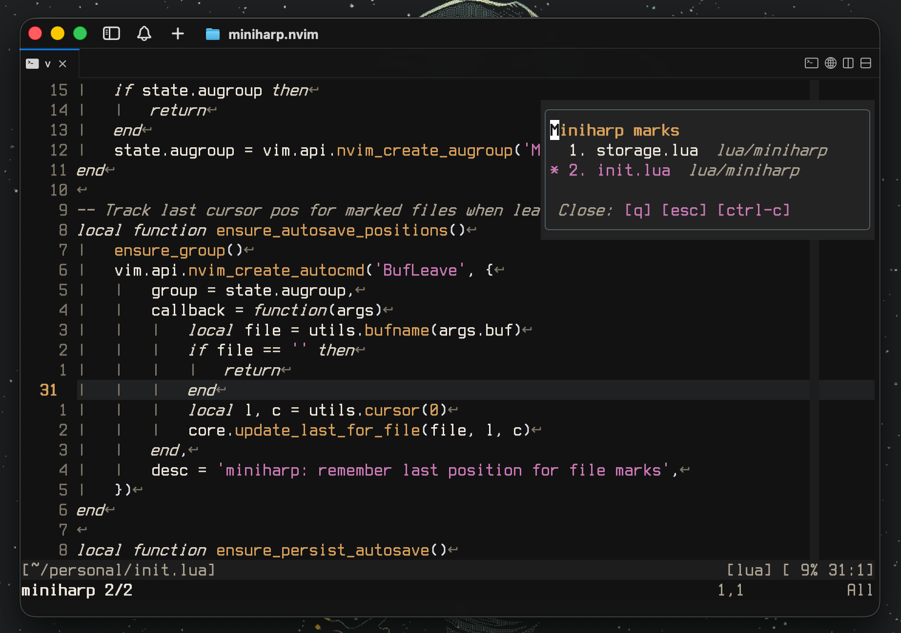

# miniharp.nvim

> Minimal Harpoon-like plugin for Neovim. Zero deps, tiny API, optional per-cwd persistence.

Inspired by (and giving full credit to) **Harpoon** by [ThePrimeagen](https://github.com/ThePrimeagen/). If you want a richer feature set (lists, terminals, advanced UI), check out [Harpoon2](https://github.com/ThePrimeagen/harpoon/tree/harpoon2).

<p align="center">
  
</p>

## Features

- **File marks**.
- **Auto-remembers last cursor position** in each marked file when you switch buffers.
- **Jump next/prev** through marked files from anywhere.
- **Per-cwd persistence** with `autoload` / `autosave` (defaults **on**).
- **Tiny floating list UI**:
  - Shows compact file names plus parent paths.
  - Marks and highlights the **current** file in the loop.
  - Can open centered or in any editor corner.
  - Can open focused or leave you in the current window.
  - Optional close hints; closes with `q`, `<Esc>`, `<C-c>`, or by calling `show_list()` again.
  - Can also be explicitly entered/focused with `enter_list()` without toggling it closed first.
  - When focused, supports `<CR>` to jump, `dd` to remove, and `<Tab>` to select/swap mark positions.
  - Optional auto-show after autoload via `show_on_autoload` (default: **off**).
- **Quieter default flow**:
  - No info notification when a cwd has no saved session yet.
  - Mark/unmark actions show a short command-line status message.
  - `next()` / `prev()` show compact loop feedback like `miniharp 2/3`.
  - Missing files are removed automatically when encountered during navigation.

## Installation

### vim.pack

```lua
vim.pack.add({
  {
    src = 'https://github.com/vieitesss/miniharp.nvim',
    version = vim.version.range("v*"), -- latest stable release
    -- version = 'nightly', -- latest changes from main
  }
})

require('miniharp').setup({
  autoload = true, -- load marks for this cwd on startup (default: true)
  autosave = true, -- save marks for this cwd on exit (default: true)
  show_on_autoload = false, -- show popup list after a successful autoload (default: false)
  ui = {
    position = 'center', -- 'center' | 'top-left' | 'top-right' | 'bottom-left' | 'bottom-right'
    show_hints = true, -- show close hints in the floating list (default: true)
    enter = true, -- enter the floating window when it opens (default: true)
  },
})
```

### lazy.nvim

```lua
{
  'vieitesss/miniharp.nvim',
  version = '*', -- latest stable release
  -- branch = 'main', -- latest nightly version
  opts = {
    autoload = true,
    autosave = true,
    show_on_autoload = false,
    ui = {
      position = 'center', -- `top-left`, `top-right`, `bottom-left`, `bottom-right`.
      show_hints = true,
      enter = true, -- Whether to enter the floating window or not
    },
  },
}
```

## Usage (recommended keymaps)

`miniharp` doesn’t force maps. Here are some defaults you might like:

```lua
vim.keymap.set('n', '<leader>m', require('miniharp').toggle_file, { desc = 'miniharp: toggle file mark' })
vim.keymap.set('n', '<C-n>',     require('miniharp').next,        { desc = 'miniharp: next file mark' })
vim.keymap.set('n', '<C-p>',     require('miniharp').prev,        { desc = 'miniharp: prev file mark' })
vim.keymap.set('n', '<leader>l', require('miniharp').show_list,   { desc = 'miniharp: toggle marks list' })
vim.keymap.set('n', '<leader>L', require('miniharp').enter_list,  { desc = 'miniharp: enter marks list' })
```

Typical flow:

1. In a file you care about, hit `<leader>m` to toggle a **file mark**.
2. Work as usual. When you leave that file, its last cursor spot is auto-saved.
3. From anywhere, use `<C-n>` / `<C-p>` to jump around marked files.
4. On a new Neovim session in the **same cwd**, marks auto-load (if `autoload = true`).  
   Toggle the list on demand with `<leader>l`, or enable `show_on_autoload = true` to open it automatically after restore.

## API

All functions are exposed from `require('miniharp')`:

- `setup(opts?)` – Initialize the plugin.

  ```lua
  ---@class MiniharpOpts
  ---@field autoload? boolean          @Load saved marks for this cwd on startup (default: true)
  ---@field autosave? boolean          @Save marks for this cwd on exit (default: true)
  ---@field show_on_autoload? boolean  @Show the marks list UI after a successful autoload (default: false)
  ---@field ui? MiniharpUIOpts         @Floating list UI options

  ---@class MiniharpUIOpts
  ---@field position? string           @'center', 'top-left', 'top-right', 'bottom-left', or 'bottom-right' (default: 'center')
  ---@field show_hints? boolean        @Show close hints in the floating list (default: true)
  ---@field enter? boolean             @Enter the floating list window when opening it (default: true)
  ```

- `toggle_file()` – Toggle a file mark for the **current** file.
- `add_file()` – Add/update a file mark for the current file at the **current cursor**.
- `next()` / `prev()` – Jump to next/previous file mark (wraps).
- `list()` – Returns a deep copy of the marks table: `{ { file, lnum, col }, ... }`.
- `clear()` – Remove all marks.
- `show_list()` – Toggle the floating list UI. If `ui.enter = true`, you can close it with `q`, `<Esc>`, or `<C-c>`. In all cases, calling `show_list()` again closes it.
- `enter_list()` – Open the floating list and enter it. If the list is already open, focus the existing list window instead of closing and reopening it. Inside the focused list, use `<CR>` to jump to the cursor line, `dd` to remove a mark, and `<Tab>` twice to swap two mark positions.
- `save()` – Manually persist marks for the current cwd.
- `restore()` – Manually restore marks for the current cwd (if present).

## Design notes

- **Minimalism first.** Small surface area and simple behavior; no dependencies.
- **Per-cwd persistence.** Keeps things project-scoped. Disable by setting `autoload = false` and/or `autosave = false`.
- **UI stays out of the way.** The popup stays lightweight, optimized for a tiny loop of files, and configurable enough to match different workflows; auto-show is opt-in.
- **Single-key toggle flow.** With `ui.enter = false`, the list behaves like a glanceable overlay that can be shown and dismissed with the same mapping.
